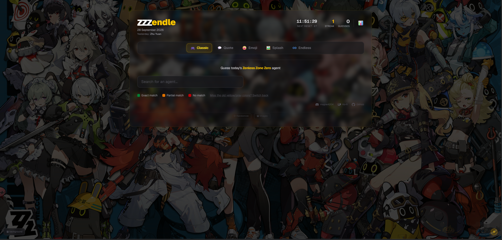
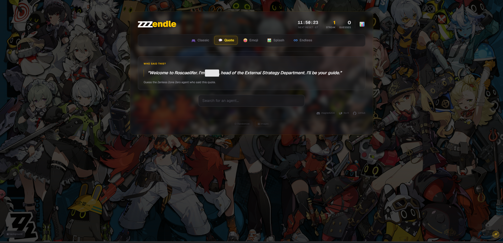
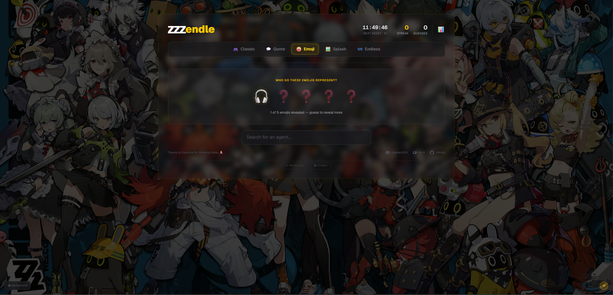
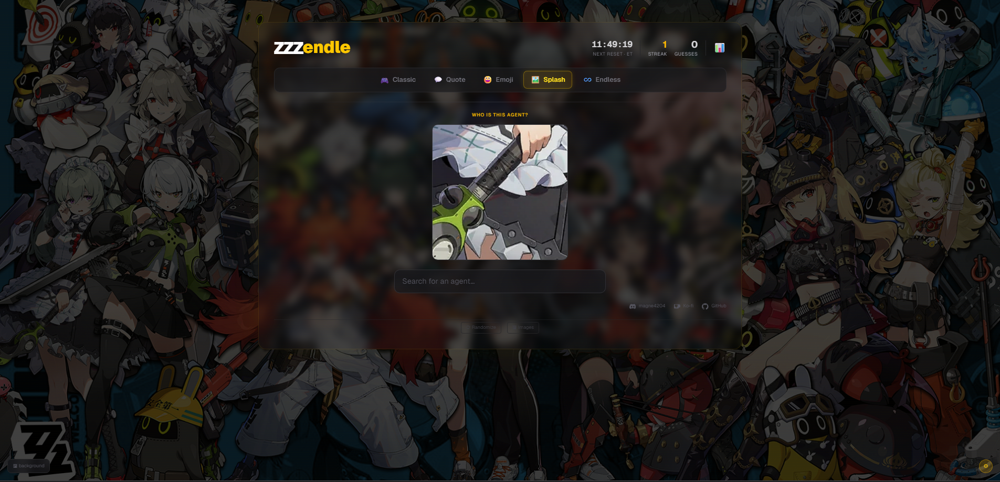
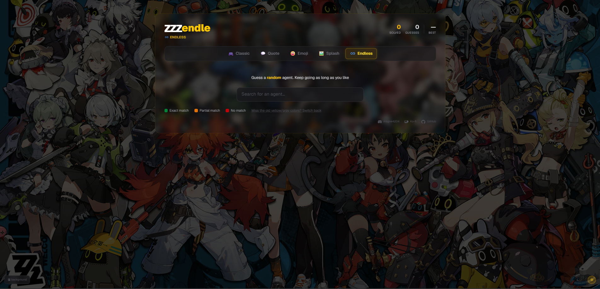
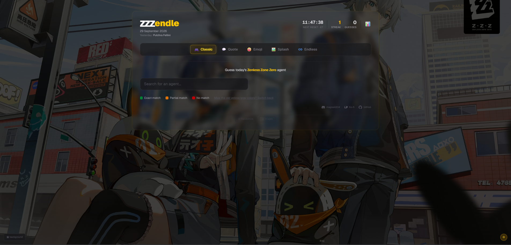

# ZZZendle

A daily guessing game for **Zenless Zone Zero** agents, in the spirit of Wordle and Loldle.

Play it at **[zzzendle.com](https://www.zzzendle.com)**. 150+ daily users.



## Game modes

| Mode | Route | How it works |
| --- | --- | --- |
| 🎮 Classic | `/` | Guess an agent. Each guess is compared on rank, attribute, specialty, faction, gender and release version. |
| 💬 Quote | `/quote` | Guess who said the voice line. |
| 😀 Emoji | `/emoji` | Guess the agent from emoji hints that unlock one at a time. |
| 🖼️ Splash | `/splash` | A zoomed-in crop of the splash art gets wider with each wrong guess. |
| ♾️ Endless | `/endless` | Unlimited rounds, not tied to the daily agent. |

A new daily agent unlocks every day. Stats and streaks are kept in the browser's `localStorage`.

<table>
  <tr>
    <td align="center"><br><b>Quote</b></td>
    <td align="center"><br><b>Emoji</b></td>
  </tr>
  <tr>
    <td align="center"><br><b>Splash</b></td>
    <td align="center"><br><b>Endless</b></td>
  </tr>
</table>

The background changes between ZZZ artworks:



## Tech stack

- [Next.js](https://nextjs.org) 16 (App Router), React 19, TypeScript
- Tailwind CSS 4
- Vitest for unit tests
- Hosted on Vercel, with Vercel Analytics

## Getting started

Requirements: Node.js 20 or newer.

```bash
git clone https://github.com/MagneSvalland/ZZZendle.git
cd ZZZendle
npm install
npm run dev
```

Then open [http://localhost:3000](http://localhost:3000).

| Command | What it does |
| --- | --- |
| `npm run dev` | Start the dev server |
| `npm run build` | Production build |
| `npm run lint` | Run ESLint |
| `npm test` | Run the Vitest suite |

No environment variables are needed to play the game. The maintainer-only dev tools (🔒 button) need `DEV_PASSWORD` in `.env.local`. Set any value there if you want to try them locally.

## Project structure

```
app/            Routes (one folder per game mode) and API routes
components/     React components (game UIs, modals, nav, etc.)
lib/            Game logic, date handling, stats, with *.test.ts files next to the code
data/
  agents.json            Every agent and their attributes, quote, emojis and images
  schedule.json          Which agent is the daily answer on each date
  splash-config.json     Per-day zoom focus for Splash mode
  classic-overrides.json Per-date overrides for Classic mode
public/images/agents/   Agent icons and portraits
```

### Adding or fixing an agent

Most content contributions only touch `data/agents.json`:

```json
{
  "id": "rina",
  "name": "Alexandrina Sebastiane",
  "rank": "S",
  "attribute": "Electric",
  "specialty": "Support",
  "faction": "Victoria Housekeeping Co.",
  "release_date": "2024-07-04",
  "release_version": "1.0",
  "gender": "Female",
  "icon_image": "/images/agents/Agent_Alexandrina_Sebastiane_Icon.png",
  "splash_image": "/images/agents/Agent_Alexandrina_Sebastiane_Portrait.png",
  "splash_focus": "center 60%",
  "quote": "Are you the new master? Rina from Victoria Housekeeping, at your service.",
  "emojis": ["⚡", "..."]
}
```

Put the matching images in `public/images/agents/`, using the same file names as the JSON.

Please don't edit `data/schedule.json` or `data/splash-config.json` in pull requests. The maintainer manages the daily schedule, and changing it can spoil or change upcoming answers.

## Contributing

Bug reports, data fixes and feature ideas are all welcome.

- **Issues:** open one for bugs (with steps to reproduce and your browser/device), wrong agent data or feature suggestions.
- **Pull requests:**
  1. Fork the repo and create a branch from `main`.
  2. Keep each PR focused on one thing.
  3. Run `npm run lint` and `npm test` before you open it.
  4. Describe what changed and why. Add screenshots for UI changes.

For larger changes, please open an issue first so we can agree on the approach before you spend time on it.

## Support

If you enjoy the game, you can support it on [Ko-fi](https://ko-fi.com/magnen). ☕

## License and disclaimer

The source code is released under the [MIT License](LICENSE).

ZZZendle is an unofficial fan project and is not affiliated with or endorsed by HoYoverse. Zenless Zone Zero and all related characters, names, artwork and voice lines are trademarks and copyright of HoYoverse (COGNOSPHERE PTE. LTD.). The MIT License covers the code in this repository only, not these game assets.
